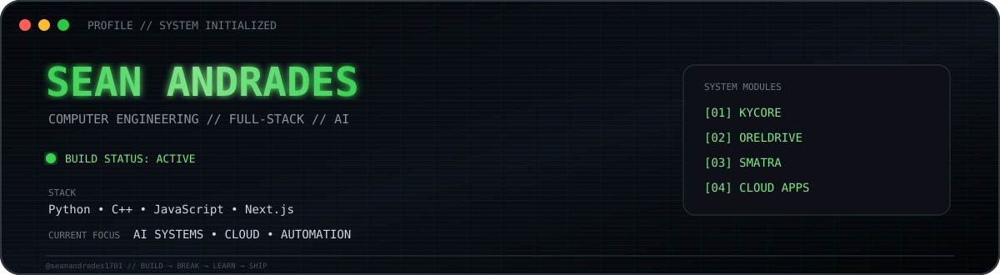
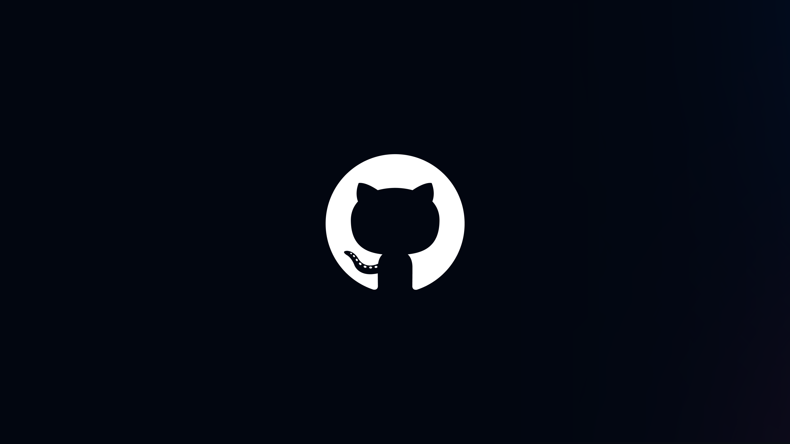

<div align="center">



</div>

<br>

<div align="center">

<a href="https://github.com/seanandrades1701">

</a>

<a href="https://www.linkedin.com/in/sean-andrades-4617522a9/">

</a>

</div>

<br>

## IDENTITY

<table>
<tr>

<td width="42%" align="center">



</td>

<td width="58%">



</td>

</tr>
</table>

---

## PROFILE

```text
SEAN ANDRADES

Final Year Computer Engineering
Full-Stack Development + AI/ML

Python • C++ • JavaScript
Next.js • React • Node.js
AWS • MongoDB • PostgreSQL
Gemini AI • OCR • Computer Vision