<h2><code>sean@github \~ $ ./contributions.sh</code></h2>

  

<h2><code>sean@github \~ $ whoami</code></h2>

<table>

<tr>

<td valign="top">

</td>

<td valign="top">

</td>

</tr>

</table>

 

<h3><code>sean@github \~ $ projects</code></h3>

Building intelligent systems, AI-powered applications,

cloud solutions, and full-stack web experiences.

