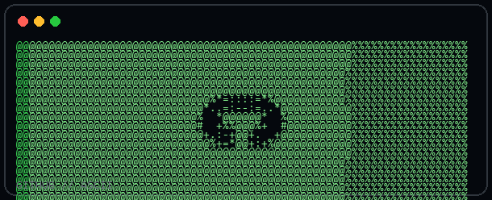
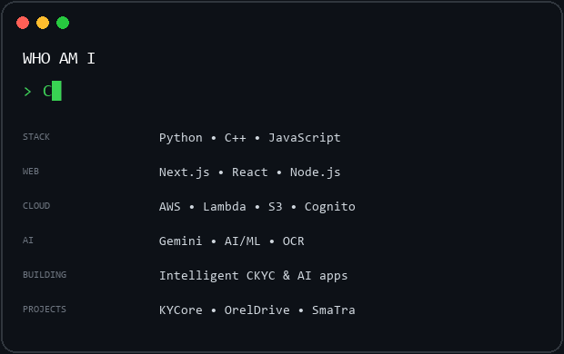

<div align="center">


</div>

<br>

<div align="center">

<a href="https://github.com/seanandrades1701">

</a>

<a href="https://www.linkedin.com/in/sean-andrades-4617522a9/">

</a>

</div>

<br>

## CONTRIBUTIONS

<div align="center">


</div>


## IDENTITY

<table>
<tr>

<td width="42%" align="center">



</td>

<td width="58%">



</td>

</tr>
</table>

---

## PROFILE

```text
SEAN ANDRADES

Final Year Computer Engineering
Full-Stack Development + AI/ML

Python - C++ - JavaScript
Next.js - React.js - Node.js
AWS - MongoDB - PostgreSQL
Gemini AI - OCR - Computer Vision
```

### TECH STACK

`Python` `C++` `JavaScript` `SQL`

`Next.js` `React.js` `Node.js` `Express.js`

`MongoDB` `MySQL` `PostgreSQL` `DynamoDB` `Prisma`

`AWS Lambda` `API Gateway` `S3` `Cognito`

`Gemini AI` `OCR` `AI/ML`

---

## EDUCATION

**B.E. Computer Engineering**  
St. Francis Institute of Technology  
`Aug 2023 - Present`

**XII - HSC**  
Thomas Baptista High School  
`70.5% - 2023`

**X - ICSE**  
St. Xavier's English Medium School  
`88.6% - 2021`

---

<div align="center">

### BUILD - BREAK - LEARN - SHIP

<br>

<a href="mailto:seanvilasandrades@gmail.com">

</a>

</div>